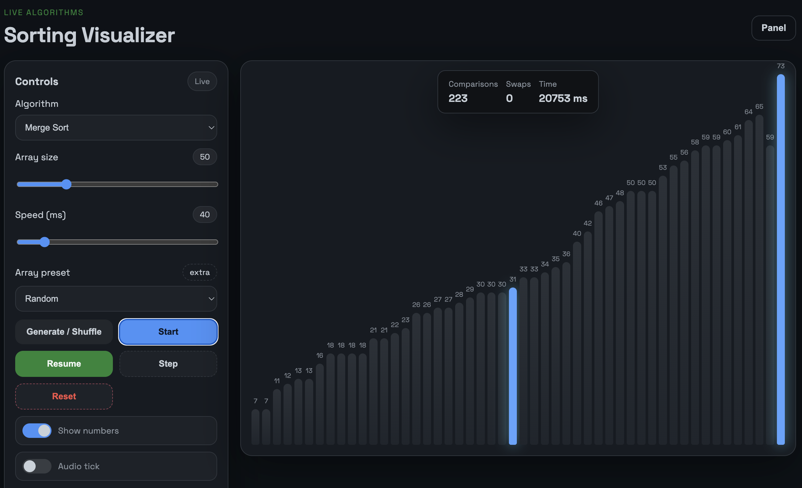

# Sorting Visualizer

Single-page app (vanilla HTML/CSS/JS) to visualize sorting algorithms with interactive controls.

## What’s inside
- Animated bars with colors for compare/swap/pivot/merge/sorted.
- Controls: start/pause/resume, single-step, reset, speed, array size (10–200), presets (random/nearly sorted/reversed), number labels toggle.
- Live stats (comparisons, swaps, time) algorithm info.

## How to try it
1) Open `index.html` in a modern browser (double-click or drag & drop) or visit https://andr-ea.github.io/Sorting-live/ 
2) Pick algorithm, size, and speed, click “Generate / Shuffle” then “Start”.

## License
MIT License. See `LICENSE` for details.

